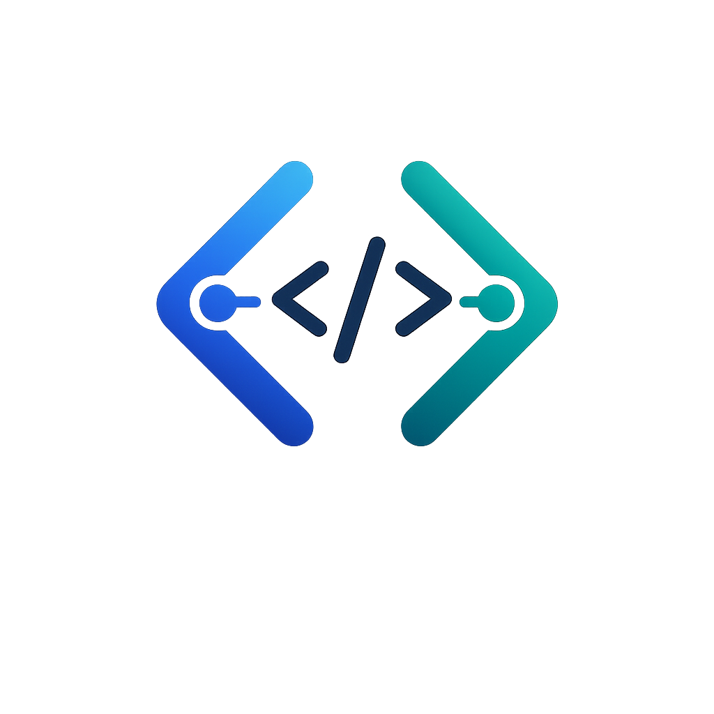

<div align="center">



# HackPair

### Real-Time Code Collaboration for Hackathon Teams

No cloud. No dashboard. No Docker. Just your IDE and your team.

[](https://github.com/Hussaincodes01/hackpair/releases)
[](LICENSE)
[](https://code.visualstudio.com)
[](https://nodejs.org)

<br>


</div>

---

## What is HackPair?

HackPair lets you and your teammates code together from anywhere. See each other's **cursors, code, and files** in real-time.

> **One extension to start. One link to share. That's it.**

---

## Features

| | |
|---|---|
| 🔴 **Live Cursors** | See where your teammates are working in your editor |
| 📝 **Real-Time Sync** | Code edits sync instantly across all members |
| 👥 **Team Awareness** | See who's online, click to view their code |
| 📂 **Shared Workspaces** | Browse anyone's file tree from your sidebar |
| 🔒 **100% Private** | Your code never leaves your machine |
| 🔄 **Auto-Reconnect** | Reopen VS Code → back in the team instantly |

---

## Quick Start

### 1. Install

Download `hackpair-0.2.1.vsix` from [Releases](https://github.com/Hussaincodes01/hackpair/releases) and install:

```bash
code --install-extension hackpair-0.2.1.vsix
```

### 2. Create Room

1. Click the **HackPair** icon in VS Code sidebar
2. Enter your name
3. Click **"Create Room"**
4. Pick your workspace folder to share
5. Copy the invite link → Share with team

### 3. Join Room

1. Click the **HackPair** icon in VS Code sidebar
2. Enter your name
3. Paste the invite link
4. Click **"Join Room"**
5. Pick your workspace folder to share

---

## How It Works

```
┌────────────────────────────────────────────────────┐
│                    HackPair                        │
├────────────────────────────────────────────────────┤
│                                                    │
│  http://192.168.1.100:3001?room=ABC123             │
│  [Copy Link] [Copy Code]                           │
│                                                    │
│  Team (3)                                          │
│  ────────────────                                  │
│  🔵 Alice (you)                                    │
│  🟢 Bob           ← click to see files             │
│  🟡 Charlie       ← click to see files             │
│                                                    │
└────────────────────────────────────────────────────┘
```

Click any teammate → See their file tree → Click a file → Read their code.

---

## Network Options

| Scenario | How |
|----------|-----|
| **Same WiFi** | Use your local IP: `http://192.168.x.x:3001` |
| **Remote Team** | Built-in [Telebit](https://telebit.cloud) tunnel — automatic on room creation |
| **Port Forwarding** | Forward port 3001 on your router |

---

## Tech Stack

| Layer | Technology |
|-------|-----------|
| Server | [Fastify](https://fastify.io) |
| Real-time | [Socket.io](https://socket.io) |
| Database | [sql.js](https://sql.js.org) (SQLite in WASM) |
| CRDT | [Y.js](https://yjs.dev) |
| Extension | [VS Code API](https://code.visualstudio.com/api) |
| Language | TypeScript |

---

## Project Structure

```
hackpair/
├── packages/
│   ├── extension/       # VS Code extension
│   │   ├── src/         # TypeScript source
│   │   └── dist/        # Bundled files
│   ├── server/          # Server source code
│   ├── shared/          # Shared types
│   └── dashboard-tool/  # Standalone server + dashboard
```

---

## Development

```bash
# Clone
git clone https://github.com/Hussaincodes01/hackpair.git
cd hackpair

# Build shared types
npx tsc -p packages/shared/tsconfig.json

# Build extension
cd packages/extension && npx esbuild src/extension.ts --bundle --outfile=dist/extension.js --external:vscode --format=cjs --platform=node

# Build server bundle
npx esbuild packages/server/src/index.ts --bundle --outfile=packages/extension/dist/server.js --platform=node --format=cjs

# Start server
node packages/extension/dist/server.js
```

---

## Contributing

1. Fork the repository
2. Create a feature branch (`git checkout -b feature/amazing`)
3. Commit changes (`git commit -m 'Add amazing feature'`)
4. Push to branch (`git push origin feature/amazing`)
5. Open a Pull Request

---

## License

MIT License - see [LICENSE](LICENSE) for details.

---

<div align="center">

**Built for hackathon teams everywhere**

[](https://github.com/Hussaincodes01)

</div>
