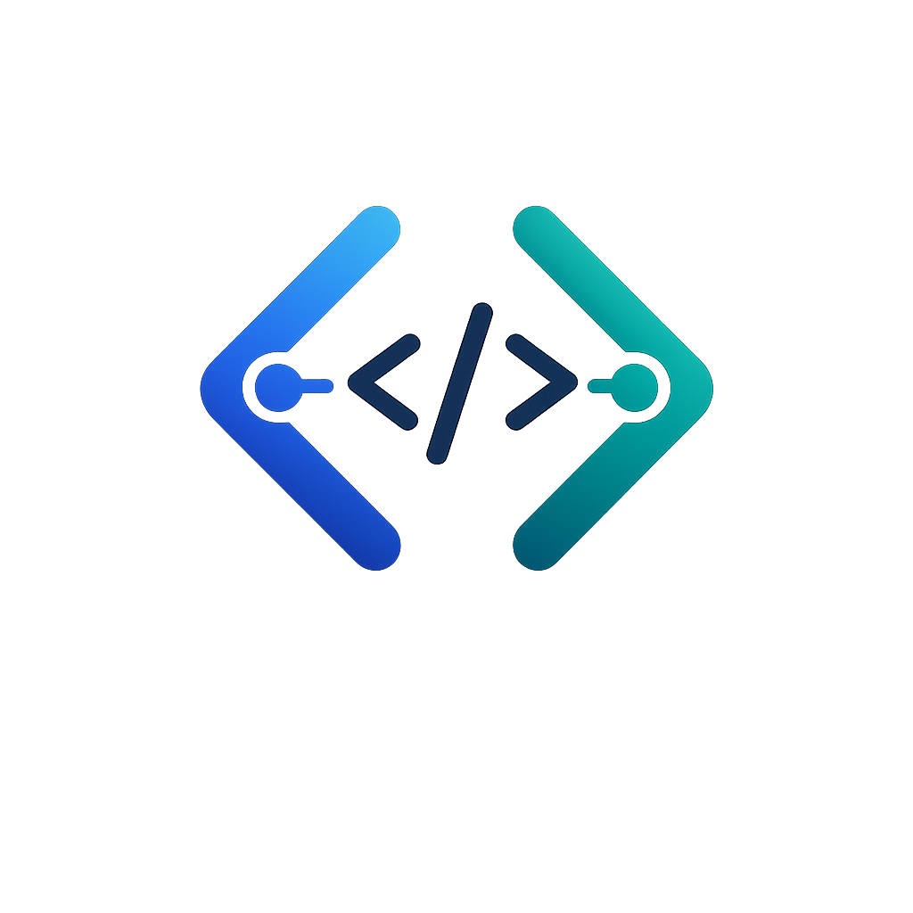

<div align="center">



# HackPair

### Real-Time Code Collaboration for Hackathon Teams

No cloud. No dashboard. No Docker. Just your IDE and your team.

[](https://github.com/Hussaincodes01/HackSyncOSS/releases)
[](LICENSE)
[](https://code.visualstudio.com)
[](https://nodejs.org)

<br>


</div>

---

## What is HackPair?

HackPair lets you and your teammates code together from anywhere. See each other's **cursors, code, and files** in real-time.

> **One extension to start. One link to share. That's it.**

The host's machine runs the server. Your code never touches anyone else's infrastructure.

---

## Features

| | |
|---|---|
| 🔴 **Live Cursors** | See where your teammates are working in your editor |
| 📝 **Real-Time Sync** | Code edits sync across all members |
| 👥 **Team Awareness** | See who's online, click to view their code |
| 📂 **Shared Workspaces** | Browse anyone's file tree from your sidebar |
| 🔒 **100% Private** | Your code never leaves your machine |
| 🔄 **Auto-Reconnect** | Reopen VS Code → back in the team instantly |
| 🔑 **Edit Permissions** | Viewers are read-only until the host grants access |

---

## Quick Start

### 1. Install

Download `hackpair-0.4.0.vsix` from [Releases](https://github.com/Hussaincodes01/HackSyncOSS/releases) and install:

```bash
code --install-extension hackpair-0.4.0.vsix
```

Or from the Extensions panel: **⋯ → Install from VSIX…**

> **Zero config.** No account, no token, no setup. Create a room and HackPair starts a public link for you automatically.

### 2. Create Room

1. Click the **HackPair** icon in VS Code sidebar
2. Enter your name
3. Click **"Create Room"**
4. Pick your workspace folder to share
5. Copy the invite link → Share with team

### 3. Join Room

1. Click the **HackPair** icon in VS Code sidebar
2. Enter your name
3. Paste the invite link
4. Click **"Join Room"**
5. Pick your workspace folder to share

---

## How It Works

```
┌────────────────────────────────────────────────────┐
│                    HackPair                        │
├────────────────────────────────────────────────────┤
│                                                    │
│  https://ab-cd-ef.trycloudflare.com?room=ABC123    │
│  [Copy Link] [Copy Code]                           │
│                                                    │
│  Team (3)                                          │
│  ────────────────                                  │
│  🔵 Alice (you)                                    │
│  🟢 Bob           ← click to see files             │
│  🟡 Charlie       ← click to see files             │
│                                                    │
└────────────────────────────────────────────────────┘
```

Click any teammate → See their file tree → Click a file → Read their code.

The **host** can edit and broadcast changes. Everyone else joins **read-only** and can press
*Request Edit Access*; the host gets a Grant/Deny prompt.

---

## What's New in 0.4.0

A round of fixes to the things that stopped the extension working end to end.

| Fix | What was wrong |
|---|---|
| **Rooms actually start** | The server was spawned with VS Code's own binary instead of Node, and readiness was detected by waiting for a log line the server never printed. Every *Create Room* failed after 8s. |
| **Auto-reconnect works** | The server deleted your member record on disconnect, so your saved token was dead the moment you closed VS Code — you silently came back as a read-only observer. |
| **Cursors & edits land** | File paths were resolved against the VS Code workspace root rather than the shared folder, so they never matched on the receiving side. Now normalised and POSIX-separated, so Windows ↔ macOS/Linux works. |
| **No more edit ping-pong** | Applying a remote edit re-broadcast it back to the sender. Edits are now debounced and echo-guarded. |
| **File trees show up** | The tree was pushed on a fixed timer that usually fired before the socket connected. It's now sent on connect. |
| **Usable invite links** | The link used the first network adapter found — often WSL, Hyper-V, or VirtualBox. Real LAN addresses are now preferred. |
| **Clicking yourself** | Used to reload the whole VS Code window and drop your session. It now shows your own shared tree. |
| **Sessions are authenticated** | An unknown token used to be silently downgraded to a read-only viewer, which also let anyone with a room id watch the room. Bad tokens are now rejected outright. |
| **The public link works** | The packaged extension shipped a 52 MB `cloudflared.exe` at a path no code read, while excluding the module needed to drive it — so the tunnel threw *"cloudflared package not found"* on every install. The binary now lives where the code looks, and the library is bundled. |
| **No more dead invite links** | cloudflared announces its URL *before* it finishes connecting. On networks that block outbound port 7844 you were handed a public link that returned HTTP 530 to everyone. HackPair now waits for a registered connection and falls back to the LAN link, telling you why. |

Also: one Cloudflare tunnel instead of two, the tunnel points at `127.0.0.1` rather than
`localhost` (the server binds IPv4 only), the database moved to VS Code global storage
(the extension folder is wiped on update), and a proper **Leave Room** that releases your slot.

> **Upgrade together.** 0.4.0 changes the extension ↔ server handshake, so every teammate
> needs 0.4.0 for a room to work.

---

## Network Options

| Scenario | How |
|----------|-----|
| **Same WiFi** | Use your local IP: `http://192.168.x.x:3001` |
| **Remote Team** | Built-in [Cloudflare](https://www.cloudflare.com/products/tunnel/) tunnel — fully automatic on room creation, no account or token |
| **Port Forwarding** | Forward port 3001 on your router |

> Cloudflare quick-tunnel URLs change every time the host restarts. Re-share the link
> after a restart, or use a LAN address if everyone is on the same network.

> **Tunnel needs outbound port 7844.** Plenty of school, corporate and conference networks
> block it. If yours does, HackPair says so and falls back to your local network link —
> share that with teammates on the same WiFi, or tether to a phone hotspot.

---

## Tech Stack

| Layer | Technology |
|-------|-----------|
| Server | [Fastify](https://fastify.io) |
| Real-time | [Socket.io](https://socket.io) |
| Database | [sql.js](https://sql.js.org) (SQLite in WASM) |
| Tunnel | [cloudflared](https://github.com/cloudflare/cloudflared) quick tunnels |
| Extension | [VS Code API](https://code.visualstudio.com/api) |
| Language | TypeScript |

> **On sync:** edits currently propagate as whole-file updates from whoever holds edit
> access. The [Y.js](https://yjs.dev) CRDT plumbing exists on the server, but the client
> does not emit deltas yet — so two people editing the *same file* at the same time will
> still overwrite each other. Have one person hold the pen per file, or
> [open an issue](https://github.com/Hussaincodes01/HackSyncOSS/issues) if you want to help
> finish it.

---

## Project Structure

```
hackpair/
├── packages/
│   ├── extension/       # VS Code extension (bundles the server)
│   │   ├── src/         # TypeScript source
│   │   └── dist/        # esbuild output: extension.js + server.js
│   ├── server/          # Fastify + Socket.IO server
│   ├── shared/          # Shared types
│   └── dashboard-tool/  # Standalone server + web dashboard
└── .github/workflows/   # Tag a release → builds and attaches the .vsix
```

---

## Development

```bash
# Clone
git clone https://github.com/Hussaincodes01/HackSyncOSS.git
cd HackSyncOSS
npm install

# Type-check everything
npm run typecheck

# Build the extension + bundled server into packages/extension/dist
node packages/extension/build.js

# Package a .vsix
npm run package --workspace=packages/extension
```

### Running the server standalone

```bash
PORT=3001 HACKPAIR_NO_TUNNEL=1 node packages/extension/dist/server.js
```

It prints `HACKPAIR_SERVER_READY port=<port>` once it can serve requests — the extension
watches for that marker, then confirms with `GET /api/health`.

| Env var | Purpose |
|---|---|
| `PORT` | Listen port (default `3001`) |
| `HOST` | Bind address (default `0.0.0.0`) |
| `HACKPAIR_NO_TUNNEL` | Set to `1` to skip the Cloudflare tunnel |
| `HACKSYNC_DATA_DIR` | Where `hacksync.db` lives (default `<server>/data`) |

### Debugging the extension

Open the repo in VS Code and press <kbd>F5</kbd> to launch an Extension Development Host.
Server logs are forwarded to the **Debug Console** prefixed with `HackPair server:`.

---

## Releasing

```bash
# 1. Bump the version in packages/*/package.json
# 2. Commit, then tag:
git tag v0.4.0
git push origin v0.4.0
```

The release workflow builds the `.vsix` and attaches it to the GitHub Release.

---

## Contributing

1. Fork the repository
2. Create a feature branch (`git checkout -b feature/amazing`)
3. Commit changes (`git commit -m 'Add amazing feature'`)
4. Push to branch (`git push origin feature/amazing`)
5. Open a Pull Request

---

## License

MIT License - see [LICENSE](LICENSE) for details.

---

<div align="center">

**Built for hackathon teams everywhere**

[](https://github.com/Hussaincodes01)

</div>
